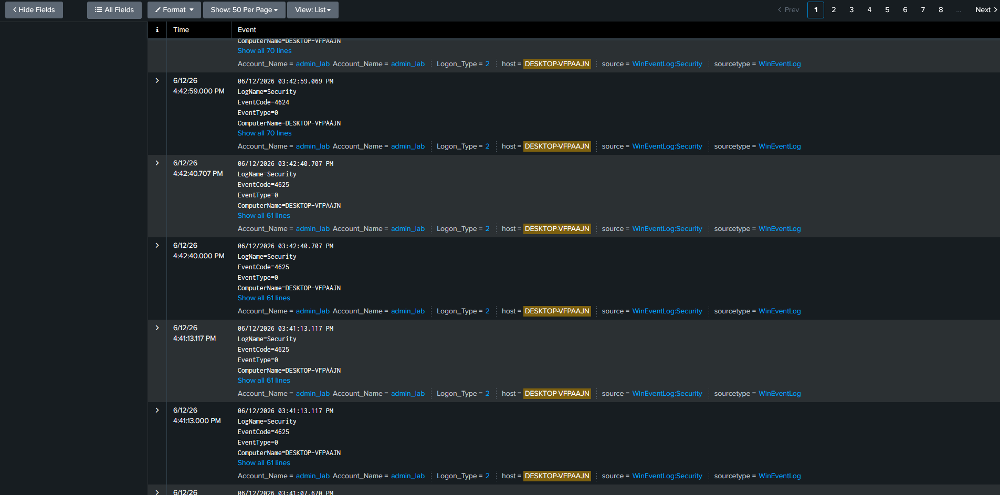

Alert: Multiple Failed Authentication Attempts 
Time: 03:40–03:43 

1 Step  i check brute force 
Spl: index=* host="DESKTOP-VFPAAJN" EventCode=4625 

I detected 8 failed logins attempts in only one user admin_lab  host = DESKTOP-VFPAAJN 
Logon Type: 2  (Interactive) 
src_ip = ::1  (localhost)
TimeLine 03:40:52.866 PM  - 03:42:40.707 PM  
Authentication attempts originated from the local host.
Logon Type 2 indicates local interactive logon activity.
No evidence of remote authentication attempts was observed.

Next step i check whether there was a successful login 
Spl:
index=* host="DESKTOP-VFPAAJN"
(EventCode=4625 OR EventCode=4624)

I see successful login on admin account (name admin_lab)
пользователь успешно вошёл после нескольких неудачных попыток
признаки компрометации отсутствуют

